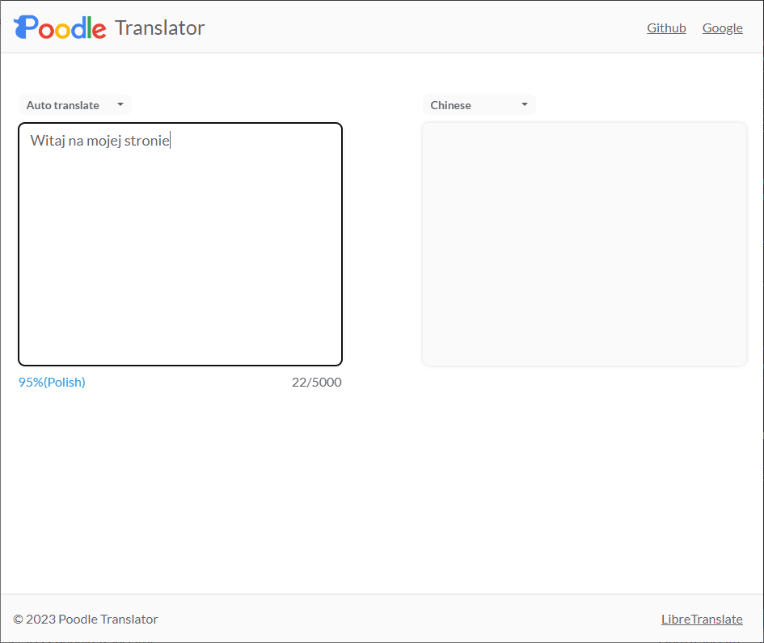
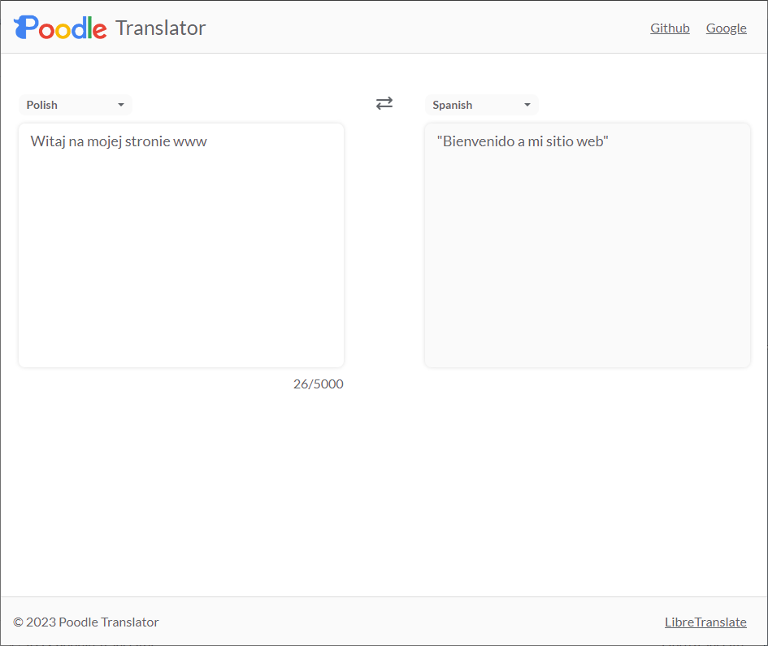
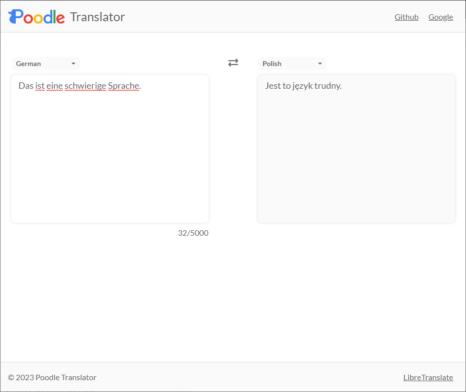
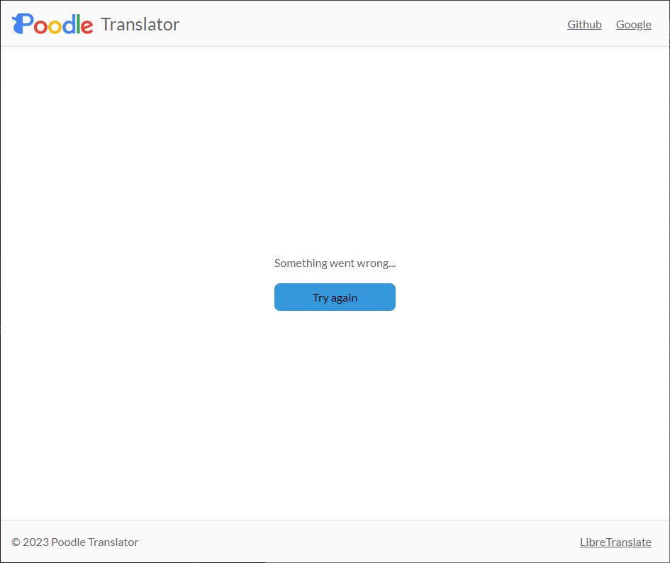

# Poodle Translator

#### Website based on Translator Google and LibreTranslate, made using React.js, TypeScript, styled-components and Translation API. 

API used is free only for local hosts, so if you want to see the page you need docker with running Translation API. 

#### Example of how the site works:
The translator recognizes the language you type and supports 5 languages: Chinese, Polish, English, Spanish and German.

In case of error of Api, informs the user about it.

